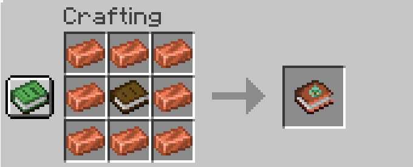
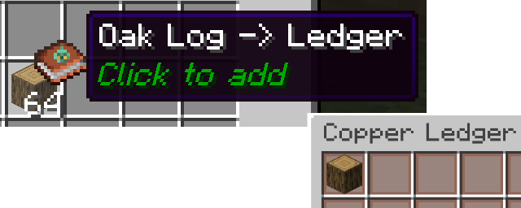
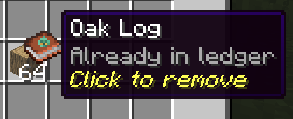
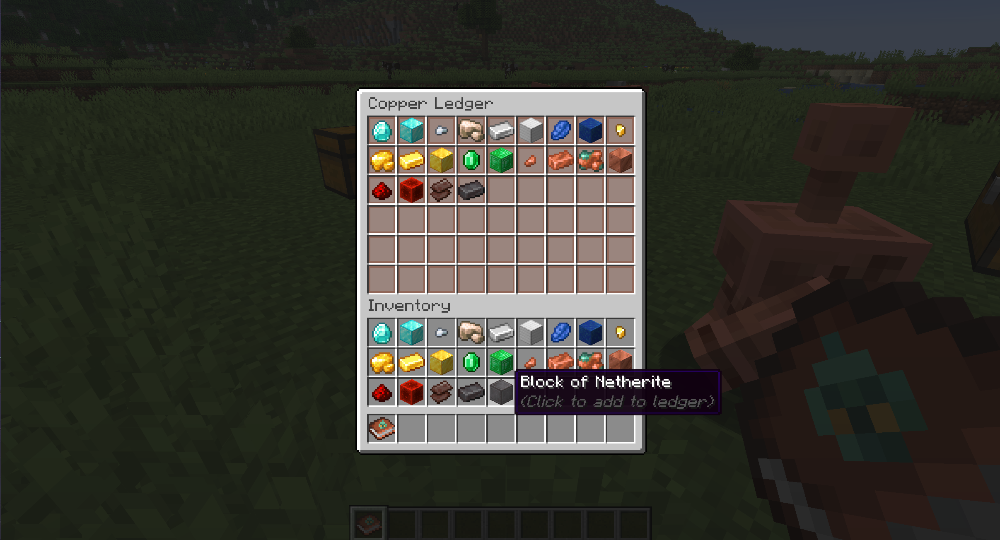
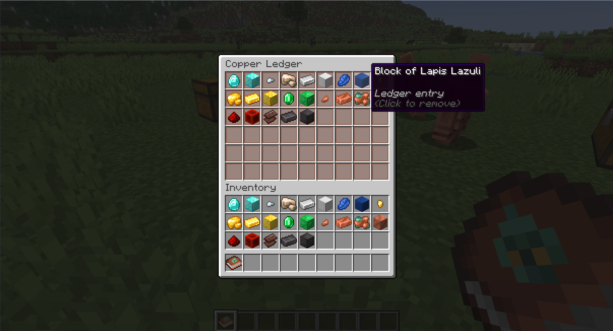
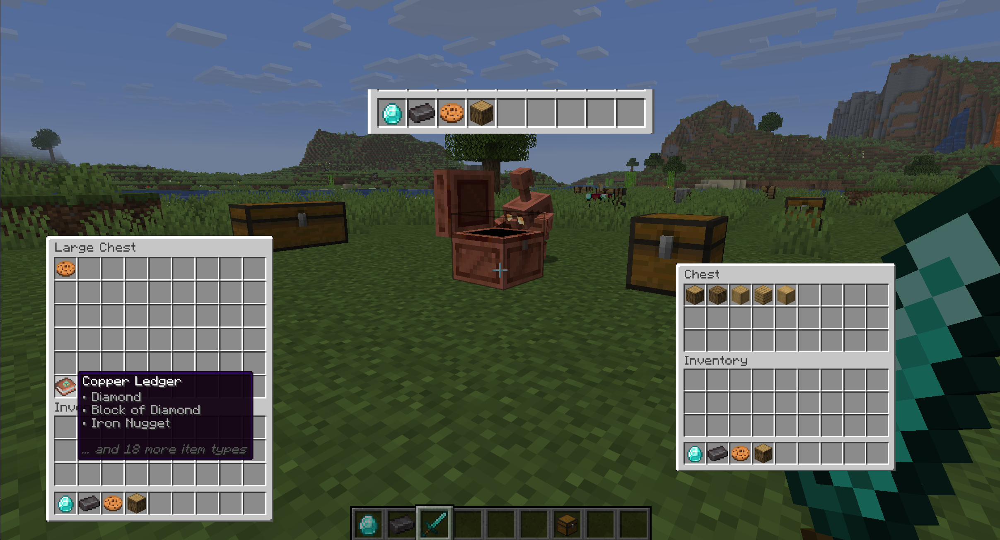
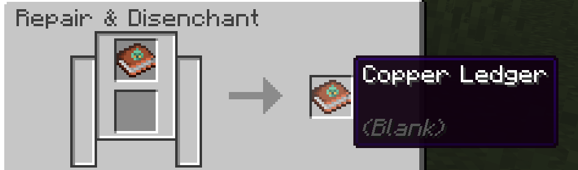
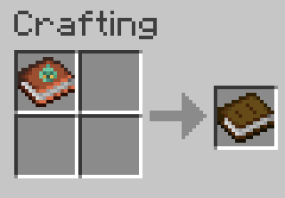

# 🤖 Copper Ledgers

#### **Help your golems remember where things go!**

## ℹ️ The mod

Ever taken your entire supply of an item out of a chest, only for your copper golems to immediately forget that's where that item belongs?

### This mod adds the **Copper Ledger**,

which allows you to create a checklist of any items from your inventory.

When you place the ledger into a chest, a copper golem will put items specified by the ledger into the chest, even if there are none actually there.

If a copper golem reaches a chest with no ledger, or a ledger that does not list the item, it falls back to the default behavior. 

### This is useful for:
- Dedicating a chest to a set of item types, without having to always keep at least one of each item in the chest
- Planning out and organizing a storage system

## 📙 Recipe

Craft a ledger by surrounding a **book** with **8 copper ingots**

## ⁉️ How to use

### Adding and removing items

#### Quick add and remove

Probably the simplest way to edit ledgers is to pick it up on your cursor and left-click on a desired item. A lot like a bundle*:

> 💡 *Note that this doesn't consume the item from your inventory. Ledgers store *records* of item types (up to 54 of them), not the actual items themselves.

Or, if the item is already in the ledger, you can remove it in the same way:

Let's start an example: we'll dedicate a chest to a bunch of ore types.

#### Full ledger screen

To open a ledger, right click with it in your hand.

You can add any item from your inventory on this screen by clicking on it.

Let's say we decided against keeping lapis with these ores. You remove items from the ledger by clicking on them.

We can now place the ledger in our desired chest.

## ⚙️ Ledgers in Action

In the example below, we'll give the golem a diamond, a netherite ingot, a cookie, and an oak log. We have two chests:
- On the left, we have a double chest with the ore ledger, along with a cookie.
    - Notice how the chest doesn't actually have any actual diamonds or netherite.
- On the right, we have a small chest, with various types of wood. This will show that chests without ledgers behave normally.

> ### 🤖 How it works
>
> When searching a chest, golems now immediately check for one or more ledgers.
> - If a ledger is found that specifies the golem's item, the golem will treat that chest as if it has that item
> - If no ledgers are found, or if none of them specify the item in the golem's hand, the golem will fall back on vanilla behavior. 

With this in mind, we expect the golem to put the diamond, netherite, and cookie into the double chest, and the oak log into the single.

And as you can see, that's exactly what happens!

### 🚮 Clear and de-craft

If you'd like to clear a ledger, you can either spam click the items away, or scrape it off in a grindstone

Or if you just want your book back, throw it into a crafting table (at the cost of your copper)

## 🖥️ Compatibility & Requirements

- Minecraft version 26.2
- Fabric (Requires Fabric API)

##  ✨️ Installation

Copper Ledgers must be installed on both the client and, if applicable, the server, due to custom items and GUIs.

## 🗺️ Potential future features

> These features are tentative ideas I'd like to pursue and are subject to change

- **Recipe Book Ledger Picker**
    - Allow players to add any item unlocked in the recipe book, instead of requiring the item to be in player inventory
    - May exist as a toggleable alternative to the existing mechanic
- **Server-only Option**
    - Allow clients to join a Copper Ledger enabled server without installing the mod locally
